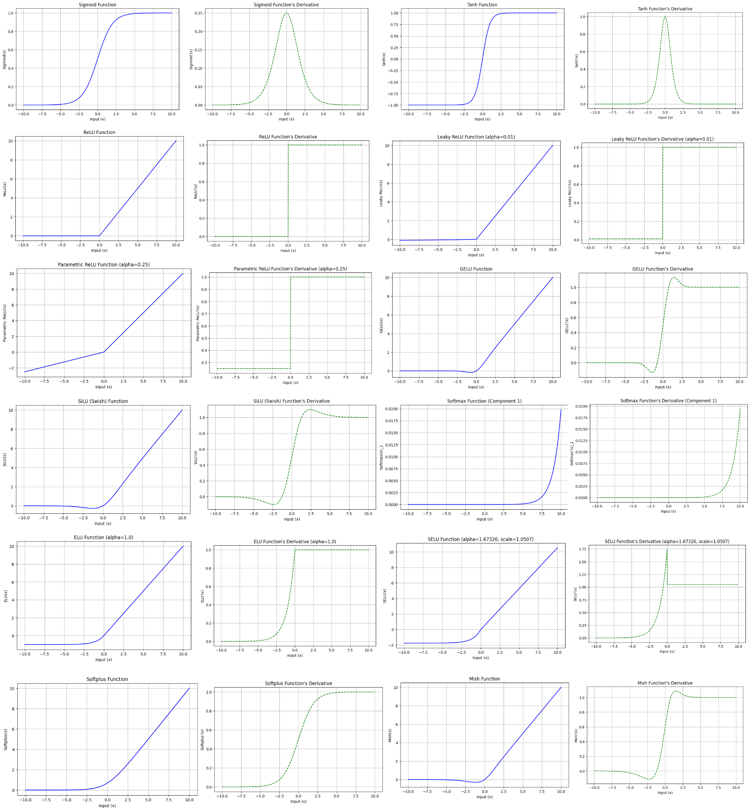

# activation functions and their derivatives

1. **sigmoid**
2. **tanh**
3. **relu**
4. **leaky relu**
5. **parametric relu**
6. **gelu**
7. **silu**
8. **softmax**
9. **elu**
10. **selu**
11. **softplus**
12. **mish**

